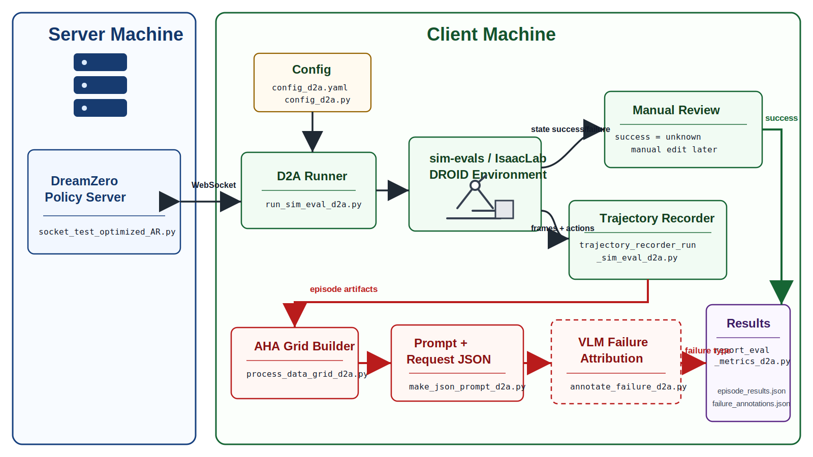

# DreamZero2AHA

DreamZero2AHA is a non-invasive adapter project for exporting attribution-ready evidence from DreamZero simulation rollouts.

The key idea is:

1. DreamZero runs the policy in `sim-evals`.
2. Rollouts are recorded without automatic success/failure judgment.
3. Episodes are converted into AHA-style multi-view temporal grids.
4. The grid and prompt are saved as AHA-ready evaluation artifacts.
5. Results are written as a per-run JSON file.

## Pipeline



## Project Contents

This project provides derivative adapter files whose names preserve the source context:

- `config_d2a.yaml`: editable project config for the DreamZero path and output path
- `config_d2a.py`: config loader that resolves relative/absolute paths from `config_d2a.yaml`
- `run_sim_eval_d2a.py`: derivative runner based on DreamZero `eval_utils/run_sim_eval.py`
- `trajectory_recorder_run_sim_eval_d2a.py`: camera/action recorder for DreamZero rollouts
- `process_data_grid_d2a.py`: AHA-style grid builder inspired by AHA `process_data.py`
- `make_json_prompt_d2a.py`: AHA conversation JSON builder inspired by AHA `make_json.py`
- `annotate_failure_d2a.py`: offline interactive annotation helper for success, task progress, and failure type
- `report_eval_metrics_d2a.py`: JSON result and summary helpers
- `schemas_d2a.py`: shared dataclasses for step records and episode results

**Note**: This project does not include the environment setup code for DreamZero and AHA. Please refer to their respective original repositories for environment configuration and activation instructions.

## How to Start

Check `config_d2a.yaml` first:

```yaml
dreamzero_root: ../DreamZero/dreamzero
output_root: output
```

`dreamzero_root` and `output_root` are resolved relative to this `DreamZero2AHA` directory unless they are absolute paths.

After starting the DreamZero policy server on the server machine, run the client-side evaluator:

```bash
python run_sim_eval_d2a.py \
  --episodes 10 \
  --scene 1 \
  --prompt "put the cube in the bowl"
```

The runner reads `config_d2a.yaml`, adds the configured DreamZero root, `eval_utils`, and `eval_utils/sim-evals/src` to `PYTHONPATH`, then switches the working directory to the DreamZero root before launching IsaacLab. This keeps DreamZero assets and relative paths compatible with the original evaluation code.

Useful runner arguments:

- `--episodes`: number of simulation episodes to run
- `--scene`: sim-evals DROID scene id; currently `1`, `2`, or `3`
- `--prompt`: task instruction sent to the DreamZero policy server; if omitted, a default prompt is selected from `--scene`
- `--host` / `--port`: optional DreamZero policy server address; when omitted, D2A reads the defaults from the configured DreamZero `eval_utils/run_sim_eval.py`
- `--output-root`: output directory; defaults to `output_root` in `config_d2a.yaml`
- `--keyframes`: number of temporal columns sampled into the AHA grid
- `--max-steps`: optional per-episode step cap; defaults to the environment max episode length
- `--video-fps`: saved rollout video frame rate

Outputs are written under `DreamZero2AHA/output/` by default and include:

- `episode_XXXX/frames/`
- `episode_XXXX/steps.json`
- `episode_XXXX/episode_N.mp4`
- `episode_XXXX/episode_N_aha_grid.jpg`
- `episode_XXXX/aha_request.json`
- `episode_results.json`

Each episode entry uses a flat evaluation schema:

```json
{
  "episode": 0,
  "scene": 1,
  "prompt": "put the cube in the bowl",
  "success": "unknown",
  "failure_type": "unknown",
  "video_path": "...",
  "aha_grid_path": "...",
  "aha_request_path": "..."
}
```

Automatic success checking is disabled. Each episode is written with `"success": "unknown"`. Task progress fields are reserved for later and are not emitted yet.

## Project Changelog

- **2026-06-30**: Created the code repository, completed the first draft of the code, and initially implemented D2A format adaptation. AHA failure attribution is not implemented in the main pipeline yet. Demo testing, debugging, and task progress setup have not been completed.
