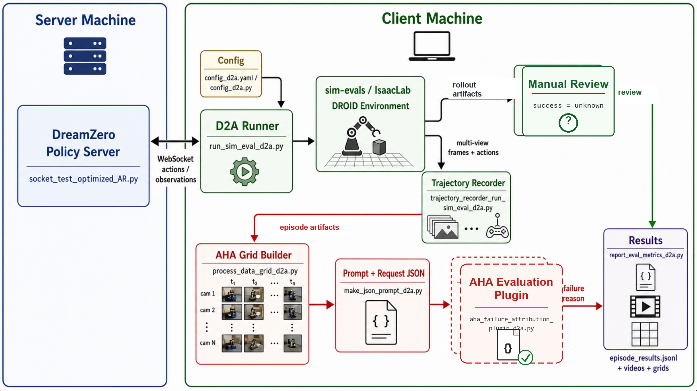

# DreamZero2AHA

DreamZero2AHA 是一个非侵入式适配子工程，用来把 DreamZero 仿真 rollout 接到 AHA 风格的失败归因流程上。

核心思路是：

1. DreamZero 在 `sim-evals` 中执行策略。
2. 仿真状态提供规则式成功/失败判定。
3. 失败 episode 被转换成 AHA 风格的多视角时间网格图。
4. 网格图和 prompt 被保存成 AHA 评测插件可消费的归因样本。
5. 每个 episode 的结果写入 JSONL。

## 流程图



## 工程内容

这里新增的是派生适配文件，文件名保留来源语义：

- `config_d2a.yaml`：可编辑的工程配置，记录 DreamZero 路径、AHA 路径和输出路径
- `config_d2a.py`：配置加载器，负责读取 `config_d2a.yaml` 并解析相对/绝对路径
- `run_sim_eval_d2a.py`：基于 DreamZero `eval_utils/run_sim_eval.py` 派生的评测入口
- `success_checkers_droid_environment_d2a.py`：面向 sim-evals DROID 场景的成功判定
- `trajectory_recorder_run_sim_eval_d2a.py`：DreamZero rollout 的相机和动作记录器
- `process_data_grid_d2a.py`：参考 AHA `process_data.py` 的网格图生成器
- `make_json_prompt_d2a.py`：参考 AHA `make_json.py` 的对话 JSON 生成器
- `aha_failure_attribution_plugin_d2a.py`：AHA 风格失败归因评测插件适配层
- `report_eval_metrics_d2a.py`：JSONL 和汇总工具
- `schemas_d2a.py`：共享数据结构，定义 step 记录、归因元数据和 JSONL episode 结果

**注**：本工程不包含DreamZero和AHA的环境配置代码，各自环境配置与激活详见原仓库。

## 运行方法

先检查 `config_d2a.yaml`：

```yaml
dreamzero_root: ../dreamzero
aha_root: ../AHA
output_root: output
```

`dreamzero_root`、`aha_root` 和 `output_root` 默认相对于 `DreamZero2AHA` 目录解析；如果写绝对路径，就直接使用绝对路径。

在 server 端启动 DreamZero policy server 后，在 client 端执行：

```bash
python run_sim_eval_d2a.py \
  --episodes 10 \
  --scene 1 \
  --prompt "put the cube in the bowl"
```

runner 会读取 `config_d2a.yaml`，把配置中的 DreamZero 根目录、`eval_utils` 和 `eval_utils/sim-evals/src` 加入 `PYTHONPATH`，然后在启动 IsaacLab 前切换工作目录到 DreamZero 根目录。这样 DreamZero 的 assets 和原评测代码中的相对路径仍然兼容。

常用参数：

- `--episodes`：运行的仿真 episode 数量
- `--scene`：sim-evals DROID 场景编号，目前对应 `1`、`2`、`3`
- `--prompt`：发送给 DreamZero policy server 的任务指令；不填时会根据 `--scene` 使用默认指令
- `--host` / `--port`：可选的 DreamZero policy server 地址和端口；不填时 D2A 会读取当前配置的 DreamZero `eval_utils/run_sim_eval.py` 里的默认值
- `--output-root`：输出目录；默认使用 `config_d2a.yaml` 里的 `output_root`
- `--keyframes`：AHA 网格图采样的时间列数量
- `--max-steps`：可选的单个 episode 最大步数；不填时使用环境默认 episode 长度
- `--video-fps`：保存 rollout 视频的帧率
- `--enable-aha-plugin` / `--no-enable-aha-plugin`：失败 episode 是否记录 AHA 评测插件元数据

默认输出会写到 `DreamZero2AHA/output/`，内容如下：

- `episode_XXXX/frames/`
- `episode_XXXX/steps.json`
- `episode_XXXX/episode_N.mp4`
- 失败时生成 `episode_XXXX/episode_N_aha_grid.jpg`
- 失败时生成 `episode_XXXX/aha_request.json`
- `episode_results.jsonl`

每一行 JSONL 核心内容如下：

```json
{
  "episode": 0,
  "scene": 1,
  "prompt": "put the cube in the bowl",
  "success": false,
  "failure_type": "unknown",
  "video_path": "...",
  "aha_grid_path": "...",
  "aha_request_path": "..."
}
```

成功 episode 的 `failure_type` 为 `null`。task progress 相关字段先预留，当前还不会输出。

## 项目修改日志

- **2026-07-01**：创建代码仓库，完成第一版代码撰写，初步实现 D2A 格式适配。未在主流程实现 AHA 失败归因逻辑，未 demo 测试，未 debug，未设置 task progress。
